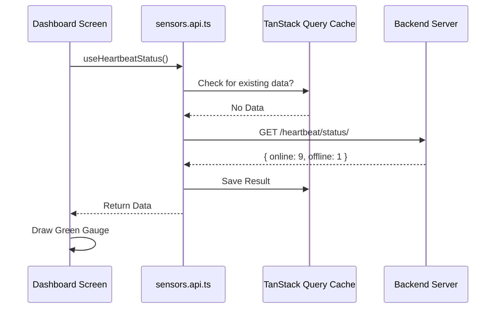

# Deep Dive: Sensor API Architectural Guide

This document provides a technical explanation of how the Sensor API layer (`src/api/sensors.api.ts`) functions, how it communicates with the React UI, and how to improve its performance.

---

## 1. The Architectural Layers

### Layer A: The Transport (Axios)
The system uses a customized Axios instance (`authAxios`).
*   **What it does:** It automatically attaches the `Bearer <token>` to every request header.
*   **How it works:** It uses an "interceptor" to check if the user is logged in before sending the request. If the token is expired, it handles the error.

### Layer B: State Management (TanStack Query)
Unlike traditional "Fetch" calls that lose data on page refresh, we use **React Query**.
*   **Caching:** When you fetch a sensor list, it stays in "memory" for 5 minutes. If you click away and come back, the data is instant.
*   **Auto-Refetch:** If the user focuses the tab or the internet reconects, the hooks automatically re-verify the data.

### Layer C: The Mock Proxy
Every hook checks the `USE_MOCK_DATA` flag.
*   **Simulation:** This allows us to simulate "Gunshot" or "Smoke" alerts without needing a real HALO device. It uses the `mockSensors` array in `mockData/sensors.ts`.

---

## 2. The Data Lifecycle (Hook ➔ Screen)

Let's take the **Monitoring Dashboard** as an example:

1.  **Component Mounts:** `SensorMonitoringDashboard.tsx` calls the hook `useHeartbeatStatus()`.
2.  **Request Triggered:** The hook checks the cache. If empty, it sends a `GET /api/devices/heartbeat/status/` request.
3.  **Data Adaption:** The JSON response is mapped to the React state.
4.  **UI Render:** The Gauges components receive the numeric values (e.g., `online_sensors: 9`) and draw the green progress bar.
5.  **Polling:** Every 10 seconds, the hook "re-triggers," updating the gauge if a sensor has gone offline.

---

## 3. Key Functional Modules

### A. Physical Hierarchy (The "Area" System)
*   **Logic:** Uses a parent-child relationship. `Area` (Building) ➔ `Sub-Area` (Floor/Room).
*   **UI Impact:** Powers the 3D Floor Plan. When you select a "Room" in the sidebar, the API filters only the sensors with that specific `area_id`.

### B. Logical Tagging (The "Group" System)
*   **Logic:** A many-to-many relationship. A sensor can be in "Maintenance Group" AND "Security Group."
*   **UI Impact:** This creates "Folders" in the UI for ease of management.

---

## 4. Strategic Improvements (The Roadmap)

To make this system enterprise-grade, we recommend the following upgrades:

### Improvement 1: Real-Time WebSockets
*   **Current:** The UI "asks" for data every few seconds (Polling).
*   **Target:** Use WebSockets so the Backend can "push" alerts to the UI instantly.
*   **Benefit:** Zero delay for emergency events like "Aggression Detection."

### Improvement 2: Optimistic UI Updates
*   **Current:** When you rename a sensor, you wait for the API to say "OK" before seeing the change.
*   **Target:** Update the UI **before** the API response. If the API fails, roll it back.
*   **Benefit:** The application feels "snappy" and local-first.

### Improvement 3: Request Batching
*   **Current:** Fetching 50 sensors might result in 50 separate configuration calls.
*   **Target:** Create a "Bulk Fetch" endpoint.
*   **Benefit:** Reduces server load and speeds up initial page load.

### Improvement 4: Persistence
*   **Current:** Mock data resets on a hard browser refresh.
*   **Target:** Sync mock data to `localStorage`.
*   **Benefit:** You can "save" your simulated environment setup.

---

## Data Flow Summary

