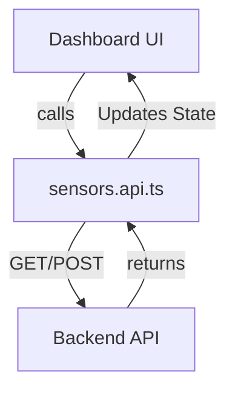

# Sensor API & UI Interaction Guide

This file documents the API endpoints implemented in `src/api/sensors.api.ts` and how they drive the HALO frontend interface.

---

## 1. Monitoring & Real-Time Dashboard
These endpoints power the live data visualizations. They use **polling** to refresh data automatically.

| API Hook | Endpoint | UI Usage |
|:---|:---|:---|
| `useAllSensorsLatestData` | `GET /api/devices/sensors/latest-data/` | Powers the **Current Readings** on the Dashboard. |
| `useHeartbeatStatus` | `GET /api/devices/heartbeat/status/` | Drives the **Online/Offline Count** gauges. |
| `useActiveEvents` | `GET /api/devices/events/active/` | Populates the **Recent Alerts Feed** (Vape, Smoke, etc.). |
| `useDeviceHealth` | `GET /api/devices/health/` | Shows the **System Health Badge** (Healthy/Unhealthy). |

**UI Interaction Example:**
```tsx
// Used in SensorMonitoringDashboard.tsx
const { data: heartbeatStatus } = useHeartbeatStatus();
// Displays: "Online: 9 | Offline: 1"
```

---

## 2. Physical Hierarchy (Areas & Sub-Areas)
Used to organize sensors geographically (Building ➔ Floor ➔ Room).

| API Hook | Endpoint | UI Usage |
|:---|:---|:---|
| `useAreas` | `GET /api/administration/areas/` | Displays the **Location Tree** in the Sidebar/Areas page. |
| `useCreateArea` | `POST /api/administration/areas/` | Allows adding a new **Building or Floor**. |
| `useAddSensorToSubArea`| `PATCH /api/devices/sensors/{id}/` | The **"Add Sensor to Area"** button flow. |

---

## 3. Sensor Management (CRUD)
Standard operations for managing physical hardware devices.

| API Hook | Endpoint | UI Usage |
|:---|:---|:---|
| `useSensors` | `GET /api/devices/sensors/` | Powers the **All Sensors Table** with filters. |
| `useUpdateSensor` | `PATCH /api/devices/sensors/{id}/` | Powers the **Edit Sensor Modal**. |
| `useDeleteSensor` | `DELETE /api/devices/sensors/{id}/` | Triggered by the **Trash Icon** in the sensor list. |
| `useRegisterSensor` | `POST /api/devices/sensors/` | Powers the **"Register New Device"** form. |

---

## 4. Logical Grouping (Sensor Groups)
Filters or tags for sensors regardless of their physical location.

| API Hook | Endpoint | UI Usage |
|:---|:---|:---|
| `useSensorGroups` | `GET /api/devices/sensor-groups/` | Lists "Folders" like *"Maintenance Team View"*. |
| `useAddSensorGroupMembers`| `POST .../add_members/` | **"Assign Sensors"** functionality. |

---

## 5. Development & Simulation
Tools for testing the system without physical hardware.

| API Hook | Endpoint | UI Usage |
|:---|:---|:---|
| `useSendHaloData` | `POST /api/devices/halo/data/` | Powers the **HALO Simulator** tool. |
| `useSendHaloHeartbeat` | `POST /api/devices/halo/heartbeat/` | Simulates a **Device Online/Offline toggle**. |

---

## Data Interaction Diagram



> [!NOTE] 
> All hooks are powered by **TanStack Query**, providing automatic caching and background updates.
